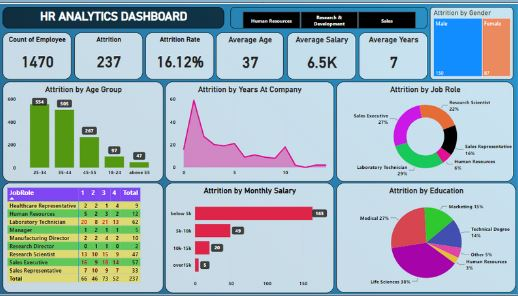

# HR ANALYTICS DASHBOARD

## Introduction

* The "WA_Fn-UseC_-HR-Employee-Attrition.csv" dataset contains detailed information about employees,
including their demographics, job roles, job satisfaction,
performance ratings, and other factors related to their employment.
## Business goal
* The aim of this project is identify the key factors that
contribute to employee attrition in the organization.
## Tools Used:
* Power BI
* Power Query
* Dax Query
  
## Questions:

1. What is the total count of employees?
2. Count total number of attrition.
3. What is the attrition rate?
4. What is the average age of employees
who have left the company?
5. What is the average salary of attrition
employees?
6. What is the average number of years
that employees who left the job worked at
the company?
7. What is the gender breakdown of
attrition employees?
8. Show the age distribution of
employees who have left the company
(attrition employees).
9. How does attrition vary by job role?
10. What is the level of satisfaction with
the company among employees from
different job roles who have left the
company?
11. How does attrition vary by Monthly
Salary?
12. What is the attrition rate by education
field?
## Dashboard

## Insights
* The highest attrition occurred among employees aged 25 to 34 years.
* Most attrition is seen among those who have worked in the company for one
to two years.
* The job role of laboratory technician (29%) and sales executive (27%) have the
highest attrition rate compared to other job roles.
* Most of the employees who left the company and whose job role was laboratory
technician gave a rating of 1 about the company, indicating their dissatisfaction
with their job.
* Most of the employees whose salary is below 5 thousand have left the
company.
* The highest rate of attrition is seen among employees whose education
field is life sciences (38%).
